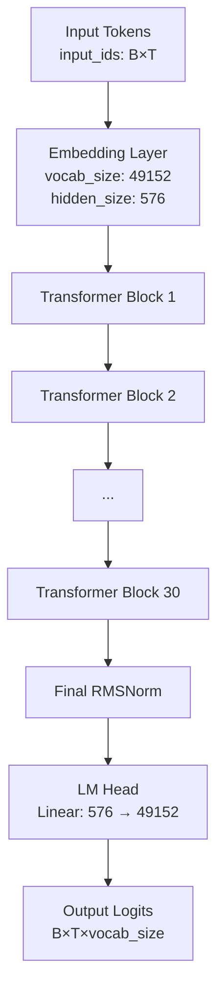
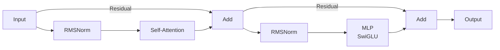
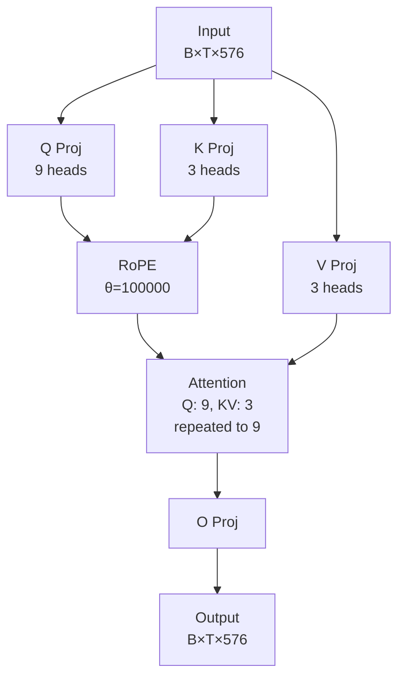
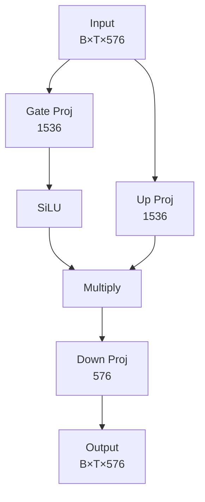

# Week13_ERAV4_SmolLM2_135M_RoPE_GQA_RMSNorm

## From-Scratch Training of SmolLM2-135M (Base)
### Reverse-Engineered Architecture using Public Hugging Face Artifacts

---

## 1. Objective of the Assignment

The objective of this assignment is to:

- Reverse engineer the **SmolLM2-135M (base)** model architecture using only **publicly available Hugging Face artifacts**
- Implement the model architecture manually (`model.py` equivalent)
- Train the model **from scratch** (random initialization, no pretrained weights)
- Demonstrate **continuous training**:
  - Train for **5000 steps**
  - Resume training from **step 5001**
  - Continue for **50 more steps** (total **5050 steps**)
- Log training progress and show checkpoint-based resumption clearly

> **Important:**  
> Training loss value is *not* evaluated.  
> Correct architecture, logging, checkpointing, and resumption are the grading criteria.

---

## 2. Reference Model (Base, NOT Instruct)

SmolLM2 is a family of compact, efficient language models developed by Hugging Face. The **SmolLM2-135M (base)** variant is a 135 million parameter decoder-only transformer model designed to deliver competitive performance while maintaining computational efficiency. Despite its relatively small size, it incorporates modern architectural innovations including:

- **Grouped Query Attention (GQA)**: Reduces memory and computation by sharing key-value heads across multiple query heads (9 query heads share 3 key-value heads)
- **Rotary Positional Embeddings (RoPE)**: Provides relative positional information without adding parameters
- **RMSNorm**: A simpler and more efficient normalization layer compared to LayerNorm
- **SwiGLU Activation**: An improved gated activation function for the MLP layers
- **Weight Tying**: Input embeddings and output projection share weights, reducing parameters

The model follows the LLaMA architecture family and is optimized for both training and inference efficiency, making it suitable for resource-constrained environments while maintaining strong language modeling capabilities.

**Reference Repository:**

All architectural details are reverse engineered from the **base model** repository:

https://huggingface.co/HuggingFaceTB/SmolLM2-135M/tree/main

Specifically, the following public file is used:

- `config.json`

No instruct model files are used.

**Model Architecture Diagram:**

The following diagram illustrates the architecture implemented in `smollm2_model.py`:



**Transformer Block Structure (repeated 30 times):**



**Self-Attention (GQA) Details:**



**MLP (SwiGLU) Details:**



**Architecture Summary:**

- **Total Parameters**: ~135M
- **Layers**: 30 transformer blocks
- **Hidden Dimension**: 576
- **Attention**: 9 query heads, 3 key-value heads (GQA ratio: 3:1)
- **MLP**: SwiGLU with intermediate size 1536 (2.67× hidden size)
- **Context Length**: 8192 tokens
- **Vocabulary**: 49152 tokens
- **Positional Encoding**: RoPE with θ = 100,000
- **Normalization**: RMSNorm (ε = 1e-5)
- **Weight Tying**: Input embeddings tied to output projection
---

## 3. What Was Reverse Engineered

The following components were reconstructed directly from the Hugging Face `config.json`:

- Decoder-only Transformer (`LlamaForCausalLM`)
- Hidden size = 576
- 30 Transformer layers
- 9 attention heads
- 3 key-value heads (Grouped Query Attention)
- SwiGLU MLP (intermediate size = 1536)
- RMSNorm
- Rotary Positional Embedding (RoPE, theta = 100000)
- Max context length = 8192
- Vocabulary size = 49152
- Tied input and output embeddings

---

## 4. Tokenization vs Model (Important Clarification)

- Tokenization converts raw text into integer token IDs.
- Hugging Face tokenizer is used **only** for text → IDs.
- Token embeddings are **learned from scratch** inside the model.
- No pretrained embeddings or weights are used.

---

## 5. File Structure

```
Week13_ERAV4_SmolLM2_135M_RoPE_GQA_RMSNorm/
│
├── smollm2_config.py
├── smollm2_model.py
├── train.py
├── sanity_check.py
├── requirements.txt
├── README.md
└── input.txt
```

---

## 6. Training Evidence Required by Assignment

- Logs printed every **500 steps**
- Explicit checkpoint at **step 5000**
- Resume training from **step 5001**
- Continuous run till **step 5050**
- Training log file preserved

---

## 7. How to Run

```bash
python sanity_check.py
python train.py --input_file input.txt
```

---

## 8. Hugging Face Upload (Placeholder)

- Model repository: TBD
- Hugging Face Space: TBD

(To be completed after training)

---

## 9. Summary

This repository demonstrates:
- Correct reverse engineering of SmolLM2-135M architecture
- Clean separation of tokenizer and neural model
- Proper from-scratch training
- Robust checkpointing and resume logic
