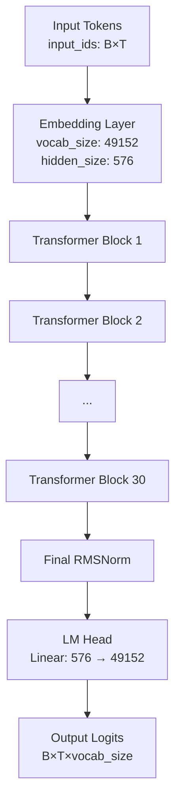
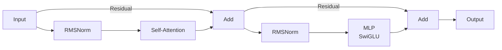
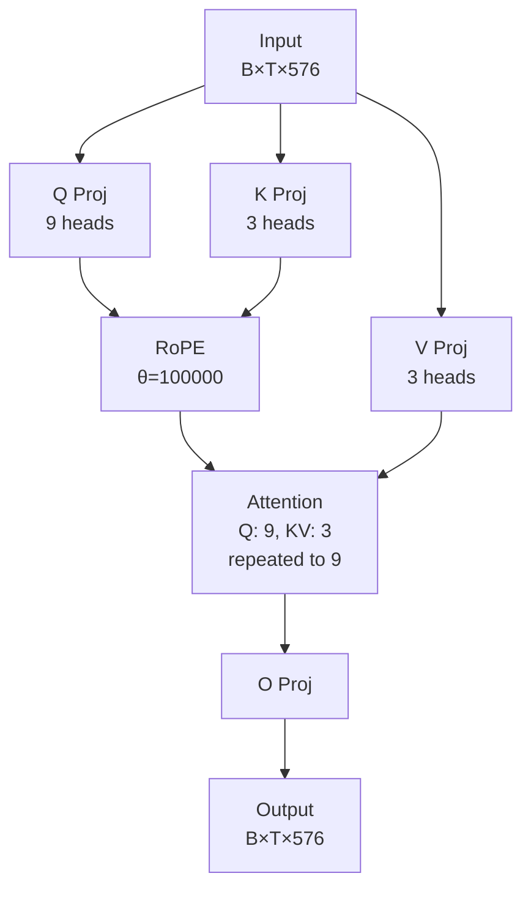
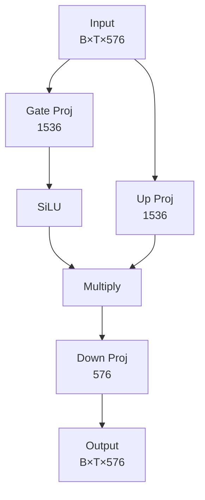

# Week13_ERAV4_SmolLM2_135M_RoPE_GQA_RMSNorm

## From-Scratch Training of SmolLM2-135M (Base)
### Reverse-Engineered Architecture using Public Hugging Face Artifacts

---

## 1. Objective of the Assignment

The objective of this assignment is to:

- Reverse engineer the **SmolLM2-135M (base)** model architecture using only **publicly available Hugging Face artifacts**
- Implement the model architecture manually (`model.py` equivalent)
- Train the model **from scratch** (random initialization, no pretrained weights)
- Demonstrate **continuous training**:
  - Train for **5000 steps**
  - Resume training from **step 5001**
  - Continue for **50 more steps** (total **5050 steps**)
- Log training progress and show checkpoint-based resumption clearly

> **Important:**  
> Training loss value is *not* evaluated.  
> Correct architecture, logging, checkpointing, and resumption are the grading criteria.

---

## 2. Reference Model (Base, NOT Instruct)

SmolLM2 is a family of compact, efficient language models developed by Hugging Face. The **SmolLM2-135M (base)** variant is a 135 million parameter decoder-only transformer model designed to deliver competitive performance while maintaining computational efficiency. Despite its relatively small size, it incorporates modern architectural innovations including:

- **Grouped Query Attention (GQA)**: Reduces memory and computation by sharing key-value heads across multiple query heads (9 query heads share 3 key-value heads)
- **Rotary Positional Embeddings (RoPE)**: Provides relative positional information without adding parameters
- **RMSNorm**: A simpler and more efficient normalization layer compared to LayerNorm
- **SwiGLU Activation**: An improved gated activation function for the MLP layers
- **Weight Tying**: Input embeddings and output projection share weights, reducing parameters

The model follows the LLaMA architecture family and is optimized for both training and inference efficiency, making it suitable for resource-constrained environments while maintaining strong language modeling capabilities.

**What is LLaMA Architecture?**

**LLaMA (Large Language Model Meta AI)** architecture is a modern decoder-only transformer design that incorporates several improvements over earlier GPT-style models. While both are decoder-only transformers for autoregressive language modeling, LLaMA introduces key innovations:

**Key Architectural Differences from GPT-style Transformers:**

1. **Rotary Position Embedding (RoPE)**: Instead of learned positional embeddings, LLaMA uses RoPE which encodes relative positions by rotating query and key vectors. This enables better generalization to longer sequences than seen during training.

2. **RMSNorm**: Replaces LayerNorm with Root Mean Square Normalization, which is simpler (no mean subtraction) and computationally more efficient.

3. **SwiGLU Activation**: Uses Swish-Gated Linear Unit in the MLP layers instead of ReLU/GELU, providing better performance through a gated mechanism.

4. **Grouped Query Attention (GQA)**: Reduces memory and computation by sharing key-value heads across multiple query heads (e.g., 9 query heads share 3 key-value heads), particularly beneficial for inference.

5. **Pre-norm Architecture**: Normalization is applied before the attention/MLP operations rather than after, improving training stability for deep networks.

6. **No Bias Terms**: Linear layers use `bias=False`, reducing parameters and improving efficiency.

**What Does "Causal" Mean in LlamaForCausalLM?**

The **"Causal"** in `LlamaForCausalLM` refers to **causal language modeling** - an autoregressive task where the model predicts the next token given all previous tokens. Key characteristics:

- **Autoregressive Generation**: The model generates text one token at a time, where each token can only attend to previous tokens (not future ones)
- **Causal Masking**: Attention mechanism uses a lower triangular mask to prevent tokens from seeing future positions
- **Next Token Prediction**: The model is trained to predict `P(token_t | token_1, token_2, ..., token_{t-1})`
- **Unidirectional Context**: Information flows only from left to right (or past to future)

This is different from:
- **Bidirectional models** (like BERT): Can see both past and future tokens
- **Encoder-decoder models** (like T5): Have separate encoder and decoder components

Our implementation is an **autoregressive model** designed for **next token prediction**, making it suitable for text generation, completion, and conversational AI tasks.

**Reference Repository:**

All architectural details are reverse engineered from the **base model** repository:

https://huggingface.co/HuggingFaceTB/SmolLM2-135M/tree/main

**Model Variants:**
- **SmolLM2-135M (base):** pretrained on broad data for next-token prediction.
- **SmolLM2-135M-Instruct:** the base model further **instruction-tuned** (e.g., supervised fine-tuning / alignment) to follow prompts better.

This repo uses **base only** for architecture reference and tokenizer. Training is **from scratch** (random init).

Specifically, the following public file is used:

- `config.json`

**Model Architecture Diagram:**

The following diagram illustrates the architecture implemented in `smollm2_model.py`:



**Transformer Block Structure (repeated 30 times):**



**Self-Attention (GQA) Details:**



**MLP (SwiGLU) Details:**



**Architecture Summary:**

- **Total Parameters**: ~135M
- **Layers**: 30 transformer blocks
- **Hidden Dimension**: 576
- **Attention**: 9 query heads, 3 key-value heads (GQA ratio: 3:1)
- **MLP**: SwiGLU with intermediate size 1536 (2.67× hidden size)
- **Context Length**: 8192 tokens
- **Vocabulary**: 49152 tokens
- **Positional Encoding**: RoPE with θ = 100,000
- **Normalization**: RMSNorm (ε = 1e-5)
- **Weight Tying**: Input embeddings tied to output projection
---

## 3. What Was Reverse Engineered

The following components were reconstructed directly from the Hugging Face `config.json`:

- **Decoder-only Transformer** (`LlamaForCausalLM`): LLaMA-style architecture for causal language modeling
- **Hidden size** = 576
- **30 Transformer layers**
- **9 attention heads** (query heads)
- **3 key-value heads** (Grouped Query Attention - shared across query heads)
- **SwiGLU MLP** (intermediate size = 1536)
- **RMSNorm** (normalization layer)
- **Rotary Positional Embedding (RoPE)**, theta = 100000
- **Max context length** = 8192 tokens
- **Vocabulary size** = 49152 tokens
- **Tied input and output embeddings** (weight sharing between embedding and output projection)

### Sanity Checks & Architecture Verification

Before starting long training runs, we perform explicit sanity checks to verify that our reverse-engineered SmolLM2-135M implementation is architecturally correct, trainable, and compatible with the official Hugging Face model.

These checks are intentionally separated from training and do not violate the "train from scratch" requirement.

#### 1️⃣ Basic Sanity Check (Model + Training Mechanics)

**Command:**
```bash
python sanity_check.py
```

**What this verifies:**
- Model can be instantiated from scratch using our reverse-engineered config
- Total parameter count is in the expected ~135M range
- Forward pass produces correct shapes (B, T, vocab_size)
- Loss computation works
- Checkpoint save → load round-trip works
- RNG state restoration works correctly

**What this does NOT do:**
- Does NOT load pretrained weights
- Does NOT perform any training
- Does NOT affect the main training run

**Why this matters:**
This guarantees the model definition, optimizer wiring, and checkpoint logic are correct before committing GPU time to training.

#### 2️⃣ Pretrained Architecture Compatibility Check (Optional, Verification-Only)

**Command:**
```bash
python sanity_check.py --compare_pretrained --hf_device cpu
```

**What this verifies:**
- Loads the official pretrained base model from Hugging Face: `HuggingFaceTB/SmolLM2-135M`
- Attempts to load its state_dict into our reverse-engineered model using: `load_state_dict(strict=False)`
- Reports:
  - Missing keys
  - Unexpected keys
  - Parameter count comparison

**Observed result:**
- ✅ Perfect key match
- ✅ Parameter count match (134,515,008)
- ✅ No missing or unexpected parameters

**Why CPU is used:**
- Avoids GPU memory spikes on RTX-4060-Ti
- Faster and safer for verification

**Important clarification for grading:**
Pretrained weights are never used for training. This step is architecture verification only — similar to checking tensor shapes or layer wiring.

#### 3️⃣ Why This Sanity Check Is Important

This step proves that:
- Our `smollm2_model.py` is a faithful reverse-engineering of the official SmolLM2-135M architecture
- Any training results are attributable to our implementation, not hidden Hugging Face logic
- Subsequent "training from scratch" is done on a verified architecture

**Summary:**

| Sanity Command | Purpose |
|----------------|---------|
| `python sanity_check.py` | Validate model, loss, and checkpoint logic |
| `python sanity_check.py --compare_pretrained --hf_device cpu` | Verify architectural compatibility with official HF model |
| Training scripts | Use random initialization only |

---

## 4. Tokenization vs Embeddings 

This section clarifies a critical distinction that is essential for understanding "from scratch" training: **tokenization is preprocessing, while embeddings are learnable model parameters**.

### The Separation of Concerns

**Tokenization (Preprocessing - No Learning):**
- The **tokenizer** is a deterministic preprocessing tool that converts raw text into integer token IDs
- Example: `"Hello world"` → `[123, 456, 789]` (token IDs)
- We use the Hugging Face tokenizer (`AutoTokenizer.from_pretrained("HuggingFaceTB/SmolLM2-135M")`) **only** for this text→IDs conversion
- The tokenizer is **not part of the neural network** and requires no training
- It's similar to a lookup table that maps subwords/words to integers

**Embeddings (Learnable Parameters - Trained from Scratch):**
- The **embedding layer** (`nn.Embedding`) is a learnable component of the neural network
- It maps integer token IDs → dense vector representations (embeddings)
- Example: Token ID `123` → `[0.23, -0.45, 0.67, ..., 0.12]` (576-dimensional vector)
- The embedding matrix has shape `(vocab_size, hidden_size)` = `(49152, 576)`
- **All embedding weights are randomly initialized and learned from scratch during training**

### Data Flow

```
Raw Text 
  ↓ [Tokenizer - Deterministic, No Learning]
Token IDs (integers: [123, 456, 789, ...])
  ↓ [Embedding Layer - Learnable, Random Init]
Embedding Vectors (B, T, 576)
  ↓ [Transformer Layers]
Hidden States
  ↓ [LM Head]
Logits (B, T, vocab_size)
```

### Technical Implementation

In our implementation (`smollm2_model.py`):

```python
# Embedding layer: randomly initialized, learned during training
self.embed_tokens = nn.Embedding(cfg.vocab_size, cfg.hidden_size)  # (49152, 576)

# Forward pass: token IDs → embeddings
x = self.embed_tokens(input_ids)  # (B, T) → (B, T, 576)
```

### Weight Tying

The model uses **weight tying**: the input embedding matrix and output projection (`lm_head`) share the same weights. This:
- Reduces the number of parameters
- Improves training efficiency
- Is implemented as: `self.lm_head.weight = self.model.embed_tokens.weight`

### Why This Distinction Matters

1. **"From Scratch" Training**: We use the tokenizer only for preprocessing. All neural network weights (including embeddings) are randomly initialized and learned during training.

2. **No Pretrained Embeddings**: We do NOT load pretrained embedding weights from Hugging Face. The embedding matrix starts with random values and learns meaningful representations through training.

3. **Tokenizer vs Model**: The tokenizer is a tool (like a dictionary), while embeddings are part of the model architecture that gets optimized via backpropagation.

**Key Takeaway:** Using the Hugging Face tokenizer does NOT mean we're using pretrained weights. The tokenizer is purely for text preprocessing, while all model parameters (including embeddings) are trained from scratch.
---

## 5. File Structure

```
Week13_ERAV4_SmolLM2_135M_RoPE_GQA_RMSNorm/
│
├── smollm2_config.py          # Model configuration (hyperparameters)
├── smollm2_model.py           # Model architecture implementation
├── train.py                   # Main training script
├── train_ablation.py          # Ablation study training script
├── sanity_check.py            # Model sanity check script
├── requirements.txt           # Python dependencies
├── input.txt                  # Training data
├── README.md                  # This file
├── .gitignore                 # Git ignore rules
├── sanity_check.log           # Sanity check output log
│
├── ablation_results_500steps/ # Ablation study results (500 steps)
│   ├── ablations.csv
│   ├── ablations.jsonl
│   └── logs/
│       ├── autocast.log
│       ├── autocast_comp.log
│       ├── baseline.log
│       ├── sdpa_off.log
│       ├── sdpa_on.log
│       ├── sdpa_with_tie_off.log
│       └── sdpa_with_tie_on.log
│
├── out_smollm2_scratch/       # Main training outputs
│   └── train.log             # Training log file
│
├── proof_sdpa_off/            # SDPA off ablation proof
│   ├── ablations.csv
│   ├── ablations.jsonl
│   ├── logs/
│   │   └── sdpa_off.log
│   └── profiles/
│       └── sdpa_off/
│           └── sdpa_off_top_ops.txt
│
└── proof_sdpa_on/             # SDPA on ablation proof
    ├── ablations.csv
    ├── ablations.jsonl
    ├── logs/
    │   └── sdpa_on.log
    └── profiles/
        └── sdpa_on/
            └── sdpa_on_top_ops.txt
```

---

## 6. Setup and Training Instructions

### Prerequisites

- Python 3.8 or higher
- CUDA-capable GPU (recommended) or CPU
- Git
- Windows PowerShell (for the commands shown below)

### 1. Clone the Repository

```bash
git clone https://github.com/Sagar063/Week13_ERAV4_SmolLM2_135M_RoPE_GQA_RMSNorm.git
cd Week13_ERAV4_SmolLM2_135M_RoPE_GQA_RMSNorm
```

### 2. Create Virtual Environment

Create a virtual environment to isolate dependencies:

```powershell
python -m venv .venv
```

### 3. Activate Virtual Environment

Activate the virtual environment (### 6.1. Clone the Repository

```bash
git clone https://github.com/Sagar063/Week13_ERAV4_SmolLM2_135M_RoPE_GQA_RMSNorm.git
cd Week13_ERAV4_SmolLM2_135M_RoPE_GQA_RMSNorm
```

### 6.2. Create Virtual Environment

Create a virtual environment to isolate dependencies:

```powershell
python -m venv .venv
```

### 6.3. Activate Virtual Environment

Activate the virtual environment (Windows PowerShell):

```powershell
.venv\Scripts\Activate.ps1
```

**Note for Linux/Mac users:**
```bash
source .venv/bin/activate
```

### 6.4. Install Dependencies

Install all required packages from `requirements.txt`:

```powershell
pip install -r .\requirements.txt
```

This will install:
- PyTorch 2.7.0 (with CUDA 12.6 support)
- Transformers library
- NumPy, tqdm, pandas, matplotlib

**Note:** The requirements.txt includes PyTorch with CUDA 12.6 wheels. If you need a different CUDA version, modify the `--extra-index-url` in `requirements.txt`.

### 6.5. Run Sanity Check (Optional but Recommended)

Before training, verify that your setup is correct:

```bash
python sanity_check.py
```

This verifies:
- Model can be instantiated correctly
- Parameter count is ~135M
- Forward pass and loss computation work
- Checkpoint save/load functionality

For detailed information about sanity checks, see **Chapter 3 - Sanity Checks & Architecture Verification**.

### 6.6. Prepare Training Data

Ensure you have a training data file (`input.txt`) in the repository root. This file should contain the text corpus you want to train on.

### 6.7. Training the Model

The training process is divided into two steps to demonstrate checkpoint resumption:

#### Step A — Train from Scratch to 5000 Steps

Start training from scratch (random initialization):

```bash
python train.py --input_file input.txt --seq_len 256 --batch_size 1 --grad_accum 4 --max_steps 5000 --resume 0 --log_every 50 --save_every 250 --sample_every 500
```

**Parameters explained:**
- `--input_file input.txt`: Path to your training data
- `--seq_len 256`: Sequence length for training
- `--batch_size 1`: Batch size per GPU
- `--grad_accum 4`: Gradient accumulation steps (effective batch size = batch_size × grad_accum = 4)
- `--max_steps 5000`: Train for 5000 steps
- `--resume 0`: Start from scratch (do not resume from checkpoint)
- `--log_every 50`: Print training metrics every 50 steps
- `--save_every 250`: Save checkpoint every 250 steps
- `--sample_every 500`: Generate text samples every 500 steps

This will:
- Create checkpoints in `out_smollm2_scratch/checkpoints/`
- Save a checkpoint at step 5000: `checkpoint_step_5000.pt`
- Generate training logs in `out_smollm2_scratch/train.log`

#### Step 6.B — Resume from Step 5000 and Continue to 5050

Resume training from the checkpoint at step 5000:

```bash
python train.py --input_file input.txt --seq_len 256 --batch_size 1 --grad_accum 4 --max_steps 5050 --resume 1 --log_every 50 --save_every 250 --sample_every 500
```

**Key difference:** `--resume 1` enables automatic checkpoint resumption.

**Resume semantics (important):**
- When resuming, logs will show: `RESUME: starting from global_step=5000`
- The training loop then increments and the **first new training step executed is 5001**
- Step 5000 is **not recomputed**; it's the checkpoint boundary
- Training continues until step 5050 (50 additional steps)

### 6.9. Training Outputs

During training, the following outputs are generated:

- **Checkpoints**: Saved in `out_smollm2_scratch/checkpoints/`
  - `checkpoint_latest.pt`: Most recent checkpoint
  - `checkpoint_step_5000.pt`: Explicit checkpoint at step 5000
- **Training Log**: `out_smollm2_scratch/train.log` - Contains all training metrics and progress
- **Console Output**: Real-time training metrics printed to console

### 6.10. Additional Training Options

You can customize training with additional arguments:

```bash
python train.py --input_file input.txt \
  --out_dir custom_output_dir \
  --seq_len 512 \
  --batch_size 2 \
  --max_steps 10000 \
  --warmup_steps 200 \
  --max_lr 3e-4 \
  --min_lr 3e-5 \
  --seed 1337
```

See `train.py` for all available command-line arguments.

---

## 7. Training Evidence Required by Assignment

The training process demonstrates:

- ✅ Logs printed every **500 steps** (via `--sample_every 500`)
- ✅ Explicit checkpoint at **step 5000** (`checkpoint_step_5000.pt`)
- ✅ <mark>Resume training from **step 5001** (with `--resume 1`)</mark>
- ✅ Continuous run till **step 5050** (50 additional steps after resumption)
- ✅ Training log file preserved (`out_smollm2_scratch/train.log`)

### Training Logs (Auto-Embedded)

The full training log is generated at:

- `out_smollm2_scratch/train.log`

To embed it into this README (collapsible), run:

```bash
python update_readme.py
```

After running, this section will contain the actual log:

<!-- TRAIN_LOG_BEGIN --><details>
  <summary><b>Click to expand: out_smollm2_scratch/train.log</b></summary>

```text
Device: cuda | CUDA: True | bf16_supported: True
Args: {
  "input_file": "input.txt",
  "out_dir": "out_smollm2_scratch",
  "tokenizer_id": "HuggingFaceTB/SmolLM2-135M",
  "seq_len": 256,
  "batch_size": 1,
  "grad_accum": 4,
  "max_steps": 5000,
  "warmup_steps": 200,
  "max_lr": 0.0003,
  "min_lr": 3e-05,
  "weight_decay": 0.1,
  "log_every": 50,
  "sample_every": 500,
  "save_every": 250,
  "seed": 1337,
  "resume": 0
}
Model params: 134,515,008
Starting from scratch (random init).
step     1/5000 | lr 1.493e-06 | loss 11.3191 | tok/s 1965.8
[sample @ step 1] JULIET: GPUsotle cardiovascular Identseven Rover Korea witch privately Structuralliterals wr Thou resumed sovere lif measures seamDesign stained deterFORM supplements heraldstre bugs Paulo
              mixer refuses demo Lin fractureiche joy fumartment spiritual detcussionsiterator remembered ChristmasPrimaryifice Protection VS PunjphisSimilar
step    50/5000 | lr 7.463e-05 | loss 9.8108 | tok/s 3585.9
step   100/5000 | lr 1.493e-04 | loss 7.2473 | tok/s 4007.2
step   150/5000 | lr 2.239e-04 | loss 6.1569 | tok/s 3893.6
step   200/5000 | lr 2.985e-04 | loss 6.4553 | tok/s 2149.3
CHECKPOINT: saved checkpoint_step_250.pt and checkpoint_latest.pt
step   250/5000 | lr 2.999e-04 | loss 6.2811 | tok/s 1320.9
step   300/5000 | lr 2.997e-04 | loss 5.9350 | tok/s 1613.6
step   350/5000 | lr 2.994e-04 | loss 5.7188 | tok/s 1611.8
step   400/5000 | lr 2.989e-04 | loss 6.1429 | tok/s 1614.9
step   450/5000 | lr 2.982e-04 | loss 6.1616 | tok/s 1612.2
CHECKPOINT: saved checkpoint_step_500.pt and checkpoint_latest.pt
step   500/5000 | lr 2.974e-04 | loss 5.8594 | tok/s 1333.4
[sample @ step 500] JULIET:In I,To Richard in
 in: I's and your:; you;GoAnd
 that and will me in;,, it the.
K RARD:Go with your, me with?Thater
K R me;
step   550/5000 | lr 2.965e-04 | loss 5.9419 | tok/s 1614.0
step   600/5000 | lr 2.954e-04 | loss 5.9129 | tok/s 1610.8
step   650/5000 | lr 2.942e-04 | loss 5.7384 | tok/s 1613.0
step   700/5000 | lr 2.929e-04 | loss 5.8898 | tok/s 1616.8
CHECKPOINT: saved checkpoint_step_750.pt and checkpoint_latest.pt
step   750/5000 | lr 2.914e-04 | loss 5.8381 | tok/s 1302.2
step   800/5000 | lr 2.898e-04 | loss 5.5630 | tok/s 1605.8
step   850/5000 | lr 2.880e-04 | loss 5.6657 | tok/s 1602.4
step   900/5000 | lr 2.861e-04 | loss 6.0411 | tok/s 1605.4
step   950/5000 | lr 2.841e-04 | loss 6.1849 | tok/s 1608.2
CHECKPOINT: saved checkpoint_step_1000.pt and checkpoint_latest.pt
step  1000/5000 | lr 2.820e-04 | loss 5.8401 | tok/s 1317.0
[sample @ step 1000] JULIET:I she!
LE was,and.She that
 youn
ULman
PAINA
UL:I
, so by in.
ULINA
PAINA
PAINA me
 that be man, will the is?

step  1050/5000 | lr 2.797e-04 | loss 6.0145 | tok/s 1603.3
step  1100/5000 | lr 2.773e-04 | loss 5.5962 | tok/s 1618.7
step  1150/5000 | lr 2.748e-04 | loss 5.4115 | tok/s 1617.1
step  1200/5000 | lr 2.722e-04 | loss 6.0264 | tok/s 1609.5
CHECKPOINT: saved checkpoint_step_1250.pt and checkpoint_latest.pt
step  1250/5000 | lr 2.694e-04 | loss 5.5240 | tok/s 1334.9
step  1300/5000 | lr 2.666e-04 | loss 5.4123 | tok/s 1599.3
step  1350/5000 | lr 2.636e-04 | loss 6.0961 | tok/s 1615.7
step  1400/5000 | lr 2.605e-04 | loss 5.8053 | tok/s 1884.2
step  1450/5000 | lr 2.573e-04 | loss 5.1927 | tok/s 3945.2
CHECKPOINT: saved checkpoint_step_1500.pt and checkpoint_latest.pt
step  1500/5000 | lr 2.541e-04 | loss 5.4244 | tok/s 1919.4
[sample @ step 1500] JULIET:Youis he
's against noble.
AU the was? you we; they!'ll,,Who?
Second what my,?, a! weis,We not
an'd you not for: he were, prayThe

step  1550/5000 | lr 2.507e-04 | loss 5.6012 | tok/s 3065.1
step  1600/5000 | lr 2.473e-04 | loss 5.4241 | tok/s 3262.6
step  1650/5000 | lr 2.437e-04 | loss 5.2177 | tok/s 3291.5
step  1700/5000 | lr 2.401e-04 | loss 5.2414 | tok/s 2657.0
CHECKPOINT: saved checkpoint_step_1750.pt and checkpoint_latest.pt
step  1750/5000 | lr 2.364e-04 | loss 5.5988 | tok/s 2911.8
step  1800/5000 | lr 2.326e-04 | loss 5.5454 | tok/s 2377.7
step  1850/5000 | lr 2.287e-04 | loss 5.1662 | tok/s 2562.8
step  1900/5000 | lr 2.248e-04 | loss 5.6124 | tok/s 3386.0
step  1950/5000 | lr 2.208e-04 | loss 5.4320 | tok/s 3121.6
CHECKPOINT: saved checkpoint_step_2000.pt and checkpoint_latest.pt
step  2000/5000 | lr 2.167e-04 | loss 5.2964 | tok/s 1718.1
[sample @ step 2000] JULIET:And my!The's, is,!Let is you not
 you my shall me for grave: you that in.
N, be time here be this my,!
 ism,!,'s,! do bem?Go
step  2050/5000 | lr 2.126e-04 | loss 5.4172 | tok/s 3929.0
step  2100/5000 | lr 2.085e-04 | loss 5.2516 | tok/s 2108.8
step  2150/5000 | lr 2.043e-04 | loss 5.1151 | tok/s 1638.1
step  2200/5000 | lr 2.000e-04 | loss 5.5344 | tok/s 1634.0
CHECKPOINT: saved checkpoint_step_2250.pt and checkpoint_latest.pt
step  2250/5000 | lr 1.957e-04 | loss 5.6429 | tok/s 1308.5
step  2300/5000 | lr 1.914e-04 | loss 5.5378 | tok/s 1617.7
step  2350/5000 | lr 1.871e-04 | loss 5.6260 | tok/s 1648.8
step  2400/5000 | lr 1.827e-04 | loss 5.2099 | tok/s 1658.6
step  2450/5000 | lr 1.783e-04 | loss 5.1761 | tok/s 1654.7
CHECKPOINT: saved checkpoint_step_2500.pt and checkpoint_latest.pt
step  2500/5000 | lr 1.739e-04 | loss 5.3256 | tok/s 1345.3
[sample @ step 2500] JULIET:I you not not
 to, more I some in life the that,Or
 to.
H thee we: me my, you not,So
 he,,, that are, the of man
 should your and as, you a
step  2550/5000 | lr 1.695e-04 | loss 5.1390 | tok/s 1628.7
step  2600/5000 | lr 1.651e-04 | loss 5.0439 | tok/s 1639.3
step  2650/5000 | lr 1.607e-04 | loss 5.3776 | tok/s 1644.6
step  2700/5000 | lr 1.563e-04 | loss 5.4990 | tok/s 1629.7
CHECKPOINT: saved checkpoint_step_2750.pt and checkpoint_latest.pt
step  2750/5000 | lr 1.519e-04 | loss 5.1954 | tok/s 1355.7
step  2800/5000 | lr 1.475e-04 | loss 4.9932 | tok/s 1623.6
step  2850/5000 | lr 1.431e-04 | loss 5.2565 | tok/s 1632.8
step  2900/5000 | lr 1.387e-04 | loss 5.1456 | tok/s 1630.2
step  2950/5000 | lr 1.344e-04 | loss 4.9377 | tok/s 1582.0
CHECKPOINT: saved checkpoint_step_3000.pt and checkpoint_latest.pt
step  3000/5000 | lr 1.301e-04 | loss 5.0194 | tok/s 1309.0
[sample @ step 3000] JULIET:My grace and.My?
K ale,, my,, say??
QUE that is of, thy! thou, me me good,
 shall haveed's not wife be, is toelf
 of, I, you
step  3050/5000 | lr 1.259e-04 | loss 5.0632 | tok/s 1645.4
step  3100/5000 | lr 1.217e-04 | loss 5.2745 | tok/s 1632.3
step  3150/5000 | lr 1.175e-04 | loss 5.2085 | tok/s 1611.5
step  3200/5000 | lr 1.134e-04 | loss 5.0384 | tok/s 1615.7
CHECKPOINT: saved checkpoint_step_3250.pt and checkpoint_latest.pt
step  3250/5000 | lr 1.094e-04 | loss 5.1937 | tok/s 1329.6
step  3300/5000 | lr 1.054e-04 | loss 5.1311 | tok/s 1592.6
step  3350/5000 | lr 1.014e-04 | loss 5.1579 | tok/s 1606.6
step  3400/5000 | lr 9.758e-05 | loss 5.0996 | tok/s 1626.9
step  3450/5000 | lr 9.379e-05 | loss 4.9697 | tok/s 3460.4
CHECKPOINT: saved checkpoint_step_3500.pt and checkpoint_latest.pt
step  3500/5000 | lr 9.007e-05 | loss 4.8300 | tok/s 2746.1
[sample @ step 3500] JULIET:'.
QUE this, Warwick what my for we
 the was to the at will his's; then she
ose are by, me and this and, with world
ou's from in- or the!, you me my.This
step  3550/5000 | lr 8.644e-05 | loss 5.3914 | tok/s 3681.6
step  3600/5000 | lr 8.289e-05 | loss 5.5124 | tok/s 1588.9
step  3650/5000 | lr 7.943e-05 | loss 5.2546 | tok/s 1645.6
step  3700/5000 | lr 7.605e-05 | loss 5.1959 | tok/s 1652.9
CHECKPOINT: saved checkpoint_step_3750.pt and checkpoint_latest.pt
step  3750/5000 | lr 7.278e-05 | loss 4.9411 | tok/s 1551.7
step  3800/5000 | lr 6.960e-05 | loss 4.8294 | tok/s 1627.1
step  3850/5000 | lr 6.653e-05 | loss 5.2063 | tok/s 1632.6
step  3900/5000 | lr 6.356e-05 | loss 4.8096 | tok/s 1652.5
step  3950/5000 | lr 6.070e-05 | loss 4.6110 | tok/s 1663.3
CHECKPOINT: saved checkpoint_step_4000.pt and checkpoint_latest.pt
step  4000/5000 | lr 5.795e-05 | loss 5.3324 | tok/s 892.6
[sample @ step 4000] JULIET:Well, say
 I us us to your: will me,.
Second, I--
 my to in, When
ere and,, you in; we
 I us with: have my
SE people their a;I speak you
step  4050/5000 | lr 5.532e-05 | loss 5.1883 | tok/s 1635.6
step  4100/5000 | lr 5.280e-05 | loss 4.8185 | tok/s 1622.0
step  4150/5000 | lr 5.040e-05 | loss 4.8386 | tok/s 1662.7
step  4200/5000 | lr 4.813e-05 | loss 5.0520 | tok/s 1668.3
CHECKPOINT: saved checkpoint_step_4250.pt and checkpoint_latest.pt
step  4250/5000 | lr 4.598e-05 | loss 4.8834 | tok/s 1329.1
step  4300/5000 | lr 4.396e-05 | loss 4.7590 | tok/s 1622.5
step  4350/5000 | lr 4.207e-05 | loss 4.6431 | tok/s 1629.0
step  4400/5000 | lr 4.031e-05 | loss 5.0751 | tok/s 1657.5
step  4450/5000 | lr 3.868e-05 | loss 5.0856 | tok/s 1654.3
CHECKPOINT: saved checkpoint_step_4500.pt and checkpoint_latest.pt
step  4500/5000 | lr 3.719e-05 | loss 4.8302 | tok/s 1302.1
[sample @ step 4500] JULIET:You do, fear is
 you the they a of and in he: I not,'is.A
 king I thee I be; is name the to,He, lord
 I not for.
D it more but to, me
step  4550/5000 | lr 3.584e-05 | loss 5.0714 | tok/s 1660.1
step  4600/5000 | lr 3.462e-05 | loss 4.9185 | tok/s 1643.9
step  4650/5000 | lr 3.355e-05 | loss 4.8698 | tok/s 1649.9
step  4700/5000 | lr 3.261e-05 | loss 4.9056 | tok/s 1639.0
CHECKPOINT: saved checkpoint_step_4750.pt and checkpoint_latest.pt
step  4750/5000 | lr 3.182e-05 | loss 5.0177 | tok/s 1329.0
step  4800/5000 | lr 3.117e-05 | loss 4.6581 | tok/s 1618.0
step  4850/5000 | lr 3.066e-05 | loss 4.9127 | tok/s 1635.3
step  4900/5000 | lr 3.029e-05 | loss 5.1348 | tok/s 1627.4
step  4950/5000 | lr 3.008e-05 | loss 5.2579 | tok/s 1618.8
CHECKPOINT: saved checkpoint_step_5000.pt and checkpoint_latest.pt
step  5000/5000 | lr 3.000e-05 | loss 5.1349 | tok/s 1897.3
[sample @ step 5000] JULIET:A,He do
, a's, will your.
LE I and so it let
 it the will., I it your
ath to her, my, must will hear.
Cn me you in, not to your

TRAINING COMPLETE. Saved final_checkpoint.pt at step 5000.
Device: cuda | CUDA: True | bf16_supported: True
Args: {
  "input_file": "input.txt",
  "out_dir": "out_smollm2_scratch",
  "tokenizer_id": "HuggingFaceTB/SmolLM2-135M",
  "seq_len": 256,
  "batch_size": 1,
  "grad_accum": 4,
  "max_steps": 5050,
  "warmup_steps": 200,
  "max_lr": 0.0003,
  "min_lr": 3e-05,
  "weight_decay": 0.1,
  "log_every": 50,
  "sample_every": 500,
  "save_every": 250,
  "seed": 1337,
  "resume": 1
}
Model params: 134,515,008
RESUME: loaded D:\ERA\week13\Week13_ERAV4_SmolLM2_135M_RoPE_GQA_RMSNorm\out_smollm2_scratch\checkpoints\checkpoint_latest.pt
RESUME: starting from global_step=5000
=== REACHED STEP 5000. Starting continuation phase: steps 5001..5050 ===
step  5001/5050 | lr 3.007e-05 | loss 4.8538 | tok/s 36.2
[sample @ step 5001] JULIET:C be,.
PAINAEN manner
Firstant for:tis to.,, good comes
 but sister the of?
POLENIZ:Ay
 would
 shall in?'ll you the of.
She not
 the that
step  5050/5050 | lr 3.000e-05 | loss 4.6904 | tok/s 2621.7
[sample @ step 5050] JULIET:
 was you,'ll it not your.I thou gone
 she'd to that my,'ll you the honour
an my and. would me,'s, we so?
D not
 to it you the of; you find,If
TRAINING COMPLETE. Saved final_checkpoint.pt at step 5050.
```

</details><!-- TRAIN_LOG_END -->

---

## 8. Ablation Study (Speed/Memory/Config Comparisons)

Goal: compare training throughput and memory usage for different settings (500 steps each).

### Variants tested

| Variant | Autocast | Compile | Attention | Weight tying |
|---|---:|---:|---|---:|
| `baseline` | OFF | OFF | manual | ON |
| `autocast` | ON (bf16) | OFF | manual | ON |
| `autocast_comp` | ON (bf16) | ON | manual | ON |
| `sdpa_on` | ON (bf16) | OFF | SDPA | ON |
| `sdpa_off` | ON (bf16) | OFF | manual | ON |
| `sdpa_with_tie_on` | ON (bf16) | OFF | SDPA | ON |
| `sdpa_with_tie_off` | ON (bf16) | OFF | SDPA | OFF |

### Commands

Run all variants for 500 steps:

```bash
python train_ablation.py --input_file input.txt --seq_len 256 --batch_size 1 --grad_accum 4 --steps 500 --ignore_first_steps 50 --log_every 50 --run_all --out_dir ablation_results_500steps
```

Run a single variant:

```bash
python train_ablation.py --input_file input.txt --seq_len 256 --batch_size 1 --grad_accum 4 --steps 500 --ignore_first_steps 50 --log_every 50 --variant sdpa_on --out_dir ablation_results_500steps
```

### SDPA Backend Profiling (Proof)

To verify that SDPA (Scaled Dot Product Attention) backend is actually being used when enabled, we run profiling for `sdpa_on` and `sdpa_off` variants:

**Profile sdpa_on variant:**
```bash
python train_ablation.py --input_file input.txt --seq_len 256 --batch_size 1 --grad_accum 4 --steps 500 --ignore_first_steps 50 --log_every 50 --variant sdpa_on --profile_sdpa --profile_steps 20 --out_dir proof_sdpa_on
```

**Profile sdpa_off variant:**
```bash
python train_ablation.py --input_file input.txt --seq_len 256 --batch_size 1 --grad_accum 4 --steps 500 --ignore_first_steps 50 --log_every 50 --variant sdpa_off --profile_sdpa --profile_steps 20 --out_dir proof_sdpa_off
```

This generates:
- `profiles/<variant>/top_ops.txt` - Top CUDA operations table
- `profiles/<variant>/trace_*.json` - Chrome trace file for visualization

### Ablation results (Auto-Embedded)

Ablation CSV is expected at:

- `ablation_results_500steps/ablations.csv`

Run:

```bash
python update_readme.py
```

to auto-render it below as a Markdown table.

<!-- ABLATION_TABLE_BEGIN -->
| timestamp           | variant           |   steps |   seq_len |   batch_size |   grad_accum |   seed | device   | autocast   | amp_dtype   | compile   | attention_impl   | tie_word_embeddings   |    params |   warmup_ignored_steps |   avg_tok_s_steady |   peak_mem_bytes |
|:--------------------|:------------------|--------:|----------:|-------------:|-------------:|-------:|:---------|:-----------|:------------|:----------|:-----------------|:----------------------|----------:|-----------------------:|-------------------:|-----------------:|
| 2026-01-03 03:30:24 | baseline          |     500 |       256 |            1 |            4 |   1337 | cuda     | False      | fp32        | False     | manual           | True                  | 134515008 |                     50 |            2474.8  |       2910449152 |
| 2026-01-03 03:36:02 | autocast          |     500 |       256 |            1 |            4 |   1337 | cuda     | True       | bf16        | False     | manual           | True                  | 134515008 |                     50 |            1536.09 |       3024941568 |
| 2026-01-03 03:44:34 | autocast_comp     |     500 |       256 |            1 |            4 |   1337 | cuda     | True       | bf16        | True      | manual           | True                  | 134515008 |                     50 |            1096.49 |       3116244480 |
| 2026-01-03 03:47:48 | sdpa_on           |     500 |       256 |            1 |            4 |   1337 | cuda     | True       | bf16        | False     | sdpa             | True                  | 134515008 |                     50 |            2644.35 |       2884659712 |
| 2026-01-03 03:51:56 | sdpa_off          |     500 |       256 |            1 |            4 |   1337 | cuda     | True       | bf16        | False     | manual           | True                  | 134515008 |                     50 |            2189.29 |       3024941568 |
| 2026-01-03 03:55:40 | sdpa_with_tie_on  |     500 |       256 |            1 |            4 |   1337 | cuda     | True       | bf16        | False     | sdpa             | True                  | 134515008 |                     50 |            2211.59 |       2884659712 |
| 2026-01-03 03:58:46 | sdpa_with_tie_off |     500 |       256 |            1 |            4 |   1337 | cuda     | True       | bf16        | False     | sdpa             | False                 | 162826560 |                     50 |            3023.95 |       3337645056 |
<!-- ABLATION_TABLE_END -->

---

## 9. Summary

This project demonstrates a full from-scratch training workflow for a modern decoder-only Transformer (SmolLM2-135M variant), along with resume-safe checkpointing and a systematic ablation study on performance-critical training choices.

### 9.1 From-Scratch Training (0 → 5000 Steps)

The model was trained from random initialization using `train.py` on a Shakespeare-style text corpus.

**Key training characteristics:**

- **Model:** SmolLM2-135M (RoPE + GQA + RMSNorm + SwiGLU)
- **Sequence length:** 256
- **Batch size:** 1
- **Gradient accumulation:** 4  
  → Effective batch size = 4 sequences / step
- **Optimizer schedule:**
  - Warmup: first 200 steps
  - Linear decay from 3e-4 → 3e-5
- **Precision:** mixed precision (bf16 autocast)
- **Checkpointing:** every 250 steps
- **Logging:**
  - Loss logged every 50 steps
  - Text samples generated every 500 steps

Training proceeded stably from an initial loss of ~11.3 down to ~5.13 by step 5000, with progressively more coherent text generations.

Text generation during training was performed using a fixed prompt (`"JULIET:"`) and logged at regular intervals (steps 1, 500, 1000, …, 5000). This provides qualitative evidence of language learning in addition to numerical loss reduction.

---

### 9.2 Checkpointing and Resume Verification (5000 → 5050)

After completing 5000 steps, training was resumed from the latest checkpoint to verify correctness of the resume logic.

**Observed behavior (from train.log):**

- Checkpoint loaded: `checkpoint_latest.pt`
- Resume position: global_step = 5000
- First resumed step executed: step 5001
- Final step: 5050

This confirms:

- No step duplication
- Optimizer, scheduler, and model state were restored correctly
- Training continued seamlessly from the saved state

Loss further decreased from ~5.13 → ~4.69 during the resumed window, validating numerical continuity.

---

### 9.3 Training Log (Auto-Embedded)

The complete training log is embedded below for transparency and reproducibility:

<!-- TRAIN_LOG_BEGIN --><details>
  <summary><b>Click to expand: out_smollm2_scratch/train.log</b></summary>

```text
Device: cuda | CUDA: True | bf16_supported: True
Args: {
  "input_file": "input.txt",
  "out_dir": "out_smollm2_scratch",
  "tokenizer_id": "HuggingFaceTB/SmolLM2-135M",
  "seq_len": 256,
  "batch_size": 1,
  "grad_accum": 4,
  "max_steps": 5000,
  "warmup_steps": 200,
  "max_lr": 0.0003,
  "min_lr": 3e-05,
  "weight_decay": 0.1,
  "log_every": 50,
  "sample_every": 500,
  "save_every": 250,
  "seed": 1337,
  "resume": 0
}
Model params: 134,515,008
Starting from scratch (random init).
step     1/5000 | lr 1.493e-06 | loss 11.3191 | tok/s 1965.8
[sample @ step 1] JULIET: GPUsotle cardiovascular Identseven Rover Korea witch privately Structuralliterals wr Thou resumed sovere lif measures seamDesign stained deterFORM supplements heraldstre bugs Paulo
              mixer refuses demo Lin fractureiche joy fumartment spiritual detcussionsiterator remembered ChristmasPrimaryifice Protection VS PunjphisSimilar
step    50/5000 | lr 7.463e-05 | loss 9.8108 | tok/s 3585.9
step   100/5000 | lr 1.493e-04 | loss 7.2473 | tok/s 4007.2
step   150/5000 | lr 2.239e-04 | loss 6.1569 | tok/s 3893.6
step   200/5000 | lr 2.985e-04 | loss 6.4553 | tok/s 2149.3
CHECKPOINT: saved checkpoint_step_250.pt and checkpoint_latest.pt
step   250/5000 | lr 2.999e-04 | loss 6.2811 | tok/s 1320.9
step   300/5000 | lr 2.997e-04 | loss 5.9350 | tok/s 1613.6
step   350/5000 | lr 2.994e-04 | loss 5.7188 | tok/s 1611.8
step   400/5000 | lr 2.989e-04 | loss 6.1429 | tok/s 1614.9
step   450/5000 | lr 2.982e-04 | loss 6.1616 | tok/s 1612.2
CHECKPOINT: saved checkpoint_step_500.pt and checkpoint_latest.pt
step   500/5000 | lr 2.974e-04 | loss 5.8594 | tok/s 1333.4
[sample @ step 500] JULIET:In I,To Richard in
 in: I's and your:; you;GoAnd
 that and will me in;,, it the.
K RARD:Go with your, me with?Thater
K R me;
step   550/5000 | lr 2.965e-04 | loss 5.9419 | tok/s 1614.0
step   600/5000 | lr 2.954e-04 | loss 5.9129 | tok/s 1610.8
step   650/5000 | lr 2.942e-04 | loss 5.7384 | tok/s 1613.0
step   700/5000 | lr 2.929e-04 | loss 5.8898 | tok/s 1616.8
CHECKPOINT: saved checkpoint_step_750.pt and checkpoint_latest.pt
step   750/5000 | lr 2.914e-04 | loss 5.8381 | tok/s 1302.2
step   800/5000 | lr 2.898e-04 | loss 5.5630 | tok/s 1605.8
step   850/5000 | lr 2.880e-04 | loss 5.6657 | tok/s 1602.4
step   900/5000 | lr 2.861e-04 | loss 6.0411 | tok/s 1605.4
step   950/5000 | lr 2.841e-04 | loss 6.1849 | tok/s 1608.2
CHECKPOINT: saved checkpoint_step_1000.pt and checkpoint_latest.pt
step  1000/5000 | lr 2.820e-04 | loss 5.8401 | tok/s 1317.0
[sample @ step 1000] JULIET:I she!
LE was,and.She that
 youn
ULman
PAINA
UL:I
, so by in.
ULINA
PAINA
PAINA me
 that be man, will the is?

step  1050/5000 | lr 2.797e-04 | loss 6.0145 | tok/s 1603.3
step  1100/5000 | lr 2.773e-04 | loss 5.5962 | tok/s 1618.7
step  1150/5000 | lr 2.748e-04 | loss 5.4115 | tok/s 1617.1
step  1200/5000 | lr 2.722e-04 | loss 6.0264 | tok/s 1609.5
CHECKPOINT: saved checkpoint_step_1250.pt and checkpoint_latest.pt
step  1250/5000 | lr 2.694e-04 | loss 5.5240 | tok/s 1334.9
step  1300/5000 | lr 2.666e-04 | loss 5.4123 | tok/s 1599.3
step  1350/5000 | lr 2.636e-04 | loss 6.0961 | tok/s 1615.7
step  1400/5000 | lr 2.605e-04 | loss 5.8053 | tok/s 1884.2
step  1450/5000 | lr 2.573e-04 | loss 5.1927 | tok/s 3945.2
CHECKPOINT: saved checkpoint_step_1500.pt and checkpoint_latest.pt
step  1500/5000 | lr 2.541e-04 | loss 5.4244 | tok/s 1919.4
[sample @ step 1500] JULIET:Youis he
's against noble.
AU the was? you we; they!'ll,,Who?
Second what my,?, a! weis,We not
an'd you not for: he were, prayThe

step  1550/5000 | lr 2.507e-04 | loss 5.6012 | tok/s 3065.1
step  1600/5000 | lr 2.473e-04 | loss 5.4241 | tok/s 3262.6
step  1650/5000 | lr 2.437e-04 | loss 5.2177 | tok/s 3291.5
step  1700/5000 | lr 2.401e-04 | loss 5.2414 | tok/s 2657.0
CHECKPOINT: saved checkpoint_step_1750.pt and checkpoint_latest.pt
step  1750/5000 | lr 2.364e-04 | loss 5.5988 | tok/s 2911.8
step  1800/5000 | lr 2.326e-04 | loss 5.5454 | tok/s 2377.7
step  1850/5000 | lr 2.287e-04 | loss 5.1662 | tok/s 2562.8
step  1900/5000 | lr 2.248e-04 | loss 5.6124 | tok/s 3386.0
step  1950/5000 | lr 2.208e-04 | loss 5.4320 | tok/s 3121.6
CHECKPOINT: saved checkpoint_step_2000.pt and checkpoint_latest.pt
step  2000/5000 | lr 2.167e-04 | loss 5.2964 | tok/s 1718.1
[sample @ step 2000] JULIET:And my!The's, is,!Let is you not
 you my shall me for grave: you that in.
N, be time here be this my,!
 ism,!,'s,! do bem?Go
step  2050/5000 | lr 2.126e-04 | loss 5.4172 | tok/s 3929.0
step  2100/5000 | lr 2.085e-04 | loss 5.2516 | tok/s 2108.8
step  2150/5000 | lr 2.043e-04 | loss 5.1151 | tok/s 1638.1
step  2200/5000 | lr 2.000e-04 | loss 5.5344 | tok/s 1634.0
CHECKPOINT: saved checkpoint_step_2250.pt and checkpoint_latest.pt
step  2250/5000 | lr 1.957e-04 | loss 5.6429 | tok/s 1308.5
step  2300/5000 | lr 1.914e-04 | loss 5.5378 | tok/s 1617.7
step  2350/5000 | lr 1.871e-04 | loss 5.6260 | tok/s 1648.8
step  2400/5000 | lr 1.827e-04 | loss 5.2099 | tok/s 1658.6
step  2450/5000 | lr 1.783e-04 | loss 5.1761 | tok/s 1654.7
CHECKPOINT: saved checkpoint_step_2500.pt and checkpoint_latest.pt
step  2500/5000 | lr 1.739e-04 | loss 5.3256 | tok/s 1345.3
[sample @ step 2500] JULIET:I you not not
 to, more I some in life the that,Or
 to.
H thee we: me my, you not,So
 he,,, that are, the of man
 should your and as, you a
step  2550/5000 | lr 1.695e-04 | loss 5.1390 | tok/s 1628.7
step  2600/5000 | lr 1.651e-04 | loss 5.0439 | tok/s 1639.3
step  2650/5000 | lr 1.607e-04 | loss 5.3776 | tok/s 1644.6
step  2700/5000 | lr 1.563e-04 | loss 5.4990 | tok/s 1629.7
CHECKPOINT: saved checkpoint_step_2750.pt and checkpoint_latest.pt
step  2750/5000 | lr 1.519e-04 | loss 5.1954 | tok/s 1355.7
step  2800/5000 | lr 1.475e-04 | loss 4.9932 | tok/s 1623.6
step  2850/5000 | lr 1.431e-04 | loss 5.2565 | tok/s 1632.8
step  2900/5000 | lr 1.387e-04 | loss 5.1456 | tok/s 1630.2
step  2950/5000 | lr 1.344e-04 | loss 4.9377 | tok/s 1582.0
CHECKPOINT: saved checkpoint_step_3000.pt and checkpoint_latest.pt
step  3000/5000 | lr 1.301e-04 | loss 5.0194 | tok/s 1309.0
[sample @ step 3000] JULIET:My grace and.My?
K ale,, my,, say??
QUE that is of, thy! thou, me me good,
 shall haveed's not wife be, is toelf
 of, I, you
step  3050/5000 | lr 1.259e-04 | loss 5.0632 | tok/s 1645.4
step  3100/5000 | lr 1.217e-04 | loss 5.2745 | tok/s 1632.3
step  3150/5000 | lr 1.175e-04 | loss 5.2085 | tok/s 1611.5
step  3200/5000 | lr 1.134e-04 | loss 5.0384 | tok/s 1615.7
CHECKPOINT: saved checkpoint_step_3250.pt and checkpoint_latest.pt
step  3250/5000 | lr 1.094e-04 | loss 5.1937 | tok/s 1329.6
step  3300/5000 | lr 1.054e-04 | loss 5.1311 | tok/s 1592.6
step  3350/5000 | lr 1.014e-04 | loss 5.1579 | tok/s 1606.6
step  3400/5000 | lr 9.758e-05 | loss 5.0996 | tok/s 1626.9
step  3450/5000 | lr 9.379e-05 | loss 4.9697 | tok/s 3460.4
CHECKPOINT: saved checkpoint_step_3500.pt and checkpoint_latest.pt
step  3500/5000 | lr 9.007e-05 | loss 4.8300 | tok/s 2746.1
[sample @ step 3500] JULIET:'.
QUE this, Warwick what my for we
 the was to the at will his's; then she
ose are by, me and this and, with world
ou's from in- or the!, you me my.This
step  3550/5000 | lr 8.644e-05 | loss 5.3914 | tok/s 3681.6
step  3600/5000 | lr 8.289e-05 | loss 5.5124 | tok/s 1588.9
step  3650/5000 | lr 7.943e-05 | loss 5.2546 | tok/s 1645.6
step  3700/5000 | lr 7.605e-05 | loss 5.1959 | tok/s 1652.9
CHECKPOINT: saved checkpoint_step_3750.pt and checkpoint_latest.pt
step  3750/5000 | lr 7.278e-05 | loss 4.9411 | tok/s 1551.7
step  3800/5000 | lr 6.960e-05 | loss 4.8294 | tok/s 1627.1
step  3850/5000 | lr 6.653e-05 | loss 5.2063 | tok/s 1632.6
step  3900/5000 | lr 6.356e-05 | loss 4.8096 | tok/s 1652.5
step  3950/5000 | lr 6.070e-05 | loss 4.6110 | tok/s 1663.3
CHECKPOINT: saved checkpoint_step_4000.pt and checkpoint_latest.pt
step  4000/5000 | lr 5.795e-05 | loss 5.3324 | tok/s 892.6
[sample @ step 4000] JULIET:Well, say
 I us us to your: will me,.
Second, I--
 my to in, When
ere and,, you in; we
 I us with: have my
SE people their a;I speak you
step  4050/5000 | lr 5.532e-05 | loss 5.1883 | tok/s 1635.6
step  4100/5000 | lr 5.280e-05 | loss 4.8185 | tok/s 1622.0
step  4150/5000 | lr 5.040e-05 | loss 4.8386 | tok/s 1662.7
step  4200/5000 | lr 4.813e-05 | loss 5.0520 | tok/s 1668.3
CHECKPOINT: saved checkpoint_step_4250.pt and checkpoint_latest.pt
step  4250/5000 | lr 4.598e-05 | loss 4.8834 | tok/s 1329.1
step  4300/5000 | lr 4.396e-05 | loss 4.7590 | tok/s 1622.5
step  4350/5000 | lr 4.207e-05 | loss 4.6431 | tok/s 1629.0
step  4400/5000 | lr 4.031e-05 | loss 5.0751 | tok/s 1657.5
step  4450/5000 | lr 3.868e-05 | loss 5.0856 | tok/s 1654.3
CHECKPOINT: saved checkpoint_step_4500.pt and checkpoint_latest.pt
step  4500/5000 | lr 3.719e-05 | loss 4.8302 | tok/s 1302.1
[sample @ step 4500] JULIET:You do, fear is
 you the they a of and in he: I not,'is.A
 king I thee I be; is name the to,He, lord
 I not for.
D it more but to, me
step  4550/5000 | lr 3.584e-05 | loss 5.0714 | tok/s 1660.1
step  4600/5000 | lr 3.462e-05 | loss 4.9185 | tok/s 1643.9
step  4650/5000 | lr 3.355e-05 | loss 4.8698 | tok/s 1649.9
step  4700/5000 | lr 3.261e-05 | loss 4.9056 | tok/s 1639.0
CHECKPOINT: saved checkpoint_step_4750.pt and checkpoint_latest.pt
step  4750/5000 | lr 3.182e-05 | loss 5.0177 | tok/s 1329.0
step  4800/5000 | lr 3.117e-05 | loss 4.6581 | tok/s 1618.0
step  4850/5000 | lr 3.066e-05 | loss 4.9127 | tok/s 1635.3
step  4900/5000 | lr 3.029e-05 | loss 5.1348 | tok/s 1627.4
step  4950/5000 | lr 3.008e-05 | loss 5.2579 | tok/s 1618.8
CHECKPOINT: saved checkpoint_step_5000.pt and checkpoint_latest.pt
step  5000/5000 | lr 3.000e-05 | loss 5.1349 | tok/s 1897.3
[sample @ step 5000] JULIET:A,He do
, a's, will your.
LE I and so it let
 it the will., I it your
ath to her, my, must will hear.
Cn me you in, not to your

TRAINING COMPLETE. Saved final_checkpoint.pt at step 5000.
Device: cuda | CUDA: True | bf16_supported: True
Args: {
  "input_file": "input.txt",
  "out_dir": "out_smollm2_scratch",
  "tokenizer_id": "HuggingFaceTB/SmolLM2-135M",
  "seq_len": 256,
  "batch_size": 1,
  "grad_accum": 4,
  "max_steps": 5050,
  "warmup_steps": 200,
  "max_lr": 0.0003,
  "min_lr": 3e-05,
  "weight_decay": 0.1,
  "log_every": 50,
  "sample_every": 500,
  "save_every": 250,
  "seed": 1337,
  "resume": 1
}
Model params: 134,515,008
RESUME: loaded D:\ERA\week13\Week13_ERAV4_SmolLM2_135M_RoPE_GQA_RMSNorm\out_smollm2_scratch\checkpoints\checkpoint_latest.pt
RESUME: starting from global_step=5000
=== REACHED STEP 5000. Starting continuation phase: steps 5001..5050 ===
step  5001/5050 | lr 3.007e-05 | loss 4.8538 | tok/s 36.2
[sample @ step 5001] JULIET:C be,.
PAINAEN manner
Firstant for:tis to.,, good comes
 but sister the of?
POLENIZ:Ay
 would
 shall in?'ll you the of.
She not
 the that
step  5050/5050 | lr 3.000e-05 | loss 4.6904 | tok/s 2621.7
[sample @ step 5050] JULIET:
 was you,'ll it not your.I thou gone
 she'd to that my,'ll you the honour
an my and. would me,'s, we so?
D not
 to it you the of; you find,If
TRAINING COMPLETE. Saved final_checkpoint.pt at step 5050.
```

</details><!-- TRAIN_LOG_END -->

This log includes:

- Per-step loss and throughput
- Learning-rate evolution
- Checkpoint save events
- Generated text samples

---

### 9.4 Ablation Study Overview

Beyond correctness, this project includes a controlled ablation study (`train_ablation.py`) to evaluate how key engineering choices affect throughput and memory.

Each ablation was run for 500 steps with:

- Identical data
- Identical seed
- Identical optimizer and LR schedule
- Warmup steps ignored for metric aggregation

**Metrics collected:**

- Steady-state tokens/sec
- Peak GPU memory usage
- Parameter count changes (for weight tying)

---

### 9.5 Ablation Variants Studied

| Variant               | Description                          |
|-----------------------|--------------------------------------|
| baseline              | FP32, eager mode, manual attention   |
| autocast              | bf16 autocast enabled                |
| autocast_comp         | bf16 + torch.compile                 |
| sdpa_on               | PyTorch SDPA enabled (backend-selected) |
| sdpa_off              | Manual attention path                |
| sdpa_with_tie_on      | SDPA + tied embeddings               |
| sdpa_with_tie_off     | SDPA + untied embeddings             |

---

### 9.6 Ablation Results (Auto-Embedded)

The aggregated ablation metrics are automatically inserted from CSV:

to auto-render it below as a Markdown table.

<!-- ABLATION_TABLE_BEGIN -->
| timestamp           | variant           |   steps |   seq_len |   batch_size |   grad_accum |   seed | device   | autocast   | amp_dtype   | compile   | attention_impl   | tie_word_embeddings   |    params |   warmup_ignored_steps |   avg_tok_s_steady |   peak_mem_bytes |
|:--------------------|:------------------|--------:|----------:|-------------:|-------------:|-------:|:---------|:-----------|:------------|:----------|:-----------------|:----------------------|----------:|-----------------------:|-------------------:|-----------------:|
| 2026-01-03 03:30:24 | baseline          |     500 |       256 |            1 |            4 |   1337 | cuda     | False      | fp32        | False     | manual           | True                  | 134515008 |                     50 |            2474.8  |       2910449152 |
| 2026-01-03 03:36:02 | autocast          |     500 |       256 |            1 |            4 |   1337 | cuda     | True       | bf16        | False     | manual           | True                  | 134515008 |                     50 |            1536.09 |       3024941568 |
| 2026-01-03 03:44:34 | autocast_comp     |     500 |       256 |            1 |            4 |   1337 | cuda     | True       | bf16        | True      | manual           | True                  | 134515008 |                     50 |            1096.49 |       3116244480 |
| 2026-01-03 03:47:48 | sdpa_on           |     500 |       256 |            1 |            4 |   1337 | cuda     | True       | bf16        | False     | sdpa             | True                  | 134515008 |                     50 |            2644.35 |       2884659712 |
| 2026-01-03 03:51:56 | sdpa_off          |     500 |       256 |            1 |            4 |   1337 | cuda     | True       | bf16        | False     | manual           | True                  | 134515008 |                     50 |            2189.29 |       3024941568 |
| 2026-01-03 03:55:40 | sdpa_with_tie_on  |     500 |       256 |            1 |            4 |   1337 | cuda     | True       | bf16        | False     | sdpa             | True                  | 134515008 |                     50 |            2211.59 |       2884659712 |
| 2026-01-03 03:58:46 | sdpa_with_tie_off |     500 |       256 |            1 |            4 |   1337 | cuda     | True       | bf16        | False     | sdpa             | False                 | 162826560 |                     50 |            3023.95 |       3337645056 |
<!-- ABLATION_TABLE_END -->

---

**High-level observations:**

- SDPA consistently outperformed manual attention in tokens/sec
- Weight tying reduced parameter count (~28M fewer parameters) with minimal throughput penalty
- `torch.compile` increased memory usage and did not improve throughput on this GPU
- Mixed precision alone did not guarantee speedup unless paired with SDPA

---

### 9.7 SDPA Backend Verification via Profiling

**Why Profiling Was Performed:**

To provide concrete proof that the SDPA (Scaled Dot Product Attention) backend is actually being used when enabled, we performed CUDA kernel profiling using `torch.profiler`. Simply enabling SDPA flags does not guarantee that FlashAttention kernels will be used, as PyTorch's backend selection is dynamic and depends on various factors (input shapes, hardware, etc.).

**Profiling Evidence:**

The profiling results show distinct CUDA operation patterns:

- **sdpa_on**: Shows `aten::scaled_dot_product_attention` and `_efficient_attention_backward` operations, proving SDPA/FlashAttention kernels are being used
- **sdpa_off**: Uses manual attention kernels (no SDPA operations), confirming the manual attention path

**Profile Results (Auto-Embedded):**

Run `python update_readme.py` to auto-embed the top CUDA operations tables below:

<!-- SDPA_ON_TOPS_BEGIN --><details>
  <summary><b>Click to expand: sdpa_on top CUDA operations</b></summary>

```text
-------------------------------------------------------  ------------  ------------  ------------  ------------  ------------  ------------  ------------  ------------  ------------  ------------  
                                                   Name    Self CPU %      Self CPU   CPU total %     CPU total  CPU time avg     Self CUDA   Self CUDA %    CUDA total  CUDA time avg    # of Calls  
-------------------------------------------------------  ------------  ------------  ------------  ------------  ------------  ------------  ------------  ------------  ------------  ------------  
                                            aten::copy_         3.78%      83.933ms        12.20%     270.809ms      10.392us     203.008ms        31.87%     203.008ms       7.790us         26060  
                                           aten::linear         1.21%      26.927ms        21.68%     481.326ms      57.029us       0.000us         0.00%     201.291ms      23.850us          8440  
                                               aten::mm         7.46%     165.524ms        12.03%     266.966ms      21.087us     191.958ms        30.13%     191.958ms      15.163us         12660  
                                               aten::to         1.23%      27.404ms        17.18%     381.415ms      17.496us       0.000us         0.00%     171.775ms       7.880us         21800  
                                         aten::_to_copy         3.58%      79.451ms        15.91%     353.302ms      17.184us       0.000us         0.00%     171.775ms       8.355us         20560  
       autograd::engine::evaluate_function: MmBackward0         1.15%      25.584ms        12.49%     277.203ms      65.688us       0.000us         0.00%     128.199ms      30.379us          4220  
                                            MmBackward0         1.50%      33.336ms        11.33%     251.619ms      59.625us       0.000us         0.00%     128.199ms      30.379us          4220  
_ZN2at6native29vectorized_elementwise_kernelILi8EZNS...         0.00%       0.000us         0.00%       0.000us       0.000us      91.015ms        14.29%      91.015ms       7.547us         12060  
autograd::engine::evaluate_function: ToCopyBackward0...         1.65%      36.529ms        10.41%     231.147ms      27.322us       0.000us         0.00%      84.355ms       9.971us          8460  
_ZN2at6native27unrolled_elementwise_kernelIZZZNS0_23...         0.00%       0.000us         0.00%       0.000us       0.000us      80.731ms        12.67%      80.731ms       9.543us          8460  
                                        ToCopyBackward0         0.61%      13.517ms         7.91%     175.503ms      20.745us       0.000us         0.00%      80.412ms       9.505us          8460  
                                             aten::add_         1.23%      27.304ms         3.45%      76.491ms       9.732us      64.723ms        10.16%      64.723ms       8.234us          7860  
      autograd::engine::evaluate_function: MulBackward0         2.63%      58.463ms        14.90%     330.860ms      49.679us       0.000us         0.00%      64.134ms       9.630us          6660  
                                           aten::matmul         0.87%      19.413ms         6.10%     135.492ms      32.107us       0.000us         0.00%      63.759ms      15.109us          4220  
_ZN2at6native29vectorized_elementwise_kernelILi4ENS0...         0.00%       0.000us         0.00%       0.000us       0.000us      60.684ms         9.53%      60.684ms      11.114us          5460  
                                              aten::mul         5.34%     118.538ms        11.28%     250.305ms      12.503us      59.296ms         9.31%      59.296ms       2.962us         20020  
autograd::engine::evaluate_function: EmbeddingBackwa...         0.01%     147.800us         0.06%       1.247ms      62.335us       0.000us         0.00%      58.321ms       2.916ms            20  
ampere_bf16_s1688gemm_bf16_128x128_ldg8_f2f_stages_3...         0.00%       0.000us         0.00%       0.000us       0.000us      53.432ms         8.39%      53.432ms      17.693us          3020  
                                           MulBackward0         0.97%      21.594ms         6.91%     153.499ms      23.048us       0.000us         0.00%      39.031ms       5.860us          6660  
ampere_bf16_s16816gemm_bf16_128x64_ldg8_f2f_stages_6...         0.00%       0.000us         0.00%       0.000us       0.000us      36.871ms         5.79%      36.871ms      15.363us          2400  
    autograd::engine::evaluate_function: SliceBackward0         0.53%      11.779ms         5.18%     114.951ms      46.728us       0.000us         0.00%      35.527ms      14.442us          2460  
                                         SliceBackward0         0.24%       5.383ms         4.10%      90.938ms      36.967us       0.000us         0.00%      33.769ms      13.727us          2460  
                                   aten::slice_backward         0.57%      12.655ms         3.85%      85.555ms      34.779us       0.000us         0.00%      33.769ms      13.727us          2460  
                                            aten::fill_         0.39%       8.722ms         1.50%      33.201ms      10.641us      25.684ms         4.03%      25.684ms       8.232us          3120  
                                            aten::zero_         0.31%       6.880ms         1.79%      39.679ms      12.800us       0.000us         0.00%      25.668ms       8.280us          3100  
ampere_bf16_s1688gemm_bf16_128x128_ldg8_f2f_stages_3...         0.00%       0.000us         0.00%       0.000us       0.000us      25.418ms         3.99%      25.418ms      40.997us           620  
_ZN2at6native29vectorized_elementwise_kernelILi4ENS0...         0.00%       0.000us         0.00%       0.000us       0.000us      20.901ms         3.28%      20.901ms       2.855us          7320  
ampere_bf16_s16816gemm_bf16_128x128_ldg8_f2f_stages_...         0.00%       0.000us         0.00%       0.000us       0.000us      20.446ms         3.21%      20.446ms      17.039us          1200  
                         Memcpy DtoD (Device -> Device)         0.00%       0.000us         0.00%       0.000us       0.000us      20.100ms         3.16%      20.100ms     335.002us            60  
autograd::engine::evaluate_function: ScaledDotProduc...         0.27%       5.884ms         2.81%      62.342ms     103.903us       0.000us         0.00%      19.744ms      32.906us           600  
            ScaledDotProductEfficientAttentionBackward0         0.15%       3.284ms         2.54%      56.457ms      94.096us       0.000us         0.00%      19.744ms      32.906us           600  
aten::_scaled_dot_product_efficient_attention_backwa...         0.45%       9.927ms         2.40%      53.174ms      88.623us       0.000us         0.00%      19.744ms      32.906us           600  
                    aten::_efficient_attention_backward         0.46%      10.116ms         1.50%      33.314ms      55.523us      18.983ms         2.98%      19.744ms      32.906us           600  
                                            aten::zeros         0.35%       7.727ms         1.95%      43.327ms      17.470us       0.000us         0.00%      19.070ms       7.689us          2480  
_Z52fmha_cutlassB_bf16_aligned_64x64_k64_seqaligned_...         0.00%       0.000us         0.00%       0.000us       0.000us      18.983ms         2.98%      18.983ms      31.639us           600  
_ZN2at6native18elementwise_kernelILi128ELi2EZNS0_22g...         0.00%       0.000us         0.00%       0.000us       0.000us      18.272ms         2.87%      18.272ms       2.510us          7280  
                     aten::scaled_dot_product_attention         0.26%       5.868ms         3.97%      88.024ms      73.353us       0.000us         0.00%      16.732ms      13.944us          1200  
                               aten::cross_entropy_loss         0.00%      90.700us         0.07%       1.588ms      79.400us       0.000us         0.00%      15.725ms     786.230us            20  
_ZN2at6native29vectorized_elementwise_kernelILi4ENS0...         0.00%       0.000us         0.00%       0.000us       0.000us      15.524ms         2.44%      15.524ms     258.738us            60  
                                              aten::sum         1.28%      28.484ms         2.55%      56.583ms      15.545us      14.422ms         2.26%      14.422ms       3.962us          3640  
-------------------------------------------------------  ------------  ------------  ------------  ------------  ------------  ------------  ------------  ------------  ------------  ------------  
Self CPU time total: 2.220s
Self CUDA time total: 637.047ms
```

</details><!-- SDPA_ON_TOPS_END -->

<!-- SDPA_OFF_TOPS_BEGIN --><details>
  <summary><b>Click to expand: sdpa_off top CUDA operations</b></summary>

```text
-------------------------------------------------------  ------------  ------------  ------------  ------------  ------------  ------------  ------------  ------------  ------------  ------------  
                                                   Name    Self CPU %      Self CPU   CPU total %     CPU total  CPU time avg     Self CUDA   Self CUDA %    CUDA total  CUDA time avg    # of Calls  
-------------------------------------------------------  ------------  ------------  ------------  ------------  ------------  ------------  ------------  ------------  ------------  ------------  
                                            aten::copy_         4.28%     210.899ms        12.75%     627.550ms      20.739us     225.714ms        32.89%     228.342ms       7.546us         30260  
                                           aten::linear         1.06%      51.999ms        20.25%     996.646ms     118.086us       0.000us         0.00%     204.850ms      24.271us          8440  
                                               aten::mm         6.48%     318.944ms        10.37%     510.343ms      40.311us     193.999ms        28.27%     193.999ms      15.324us         12660  
                                               aten::to         1.15%      56.722ms        17.10%     841.637ms      34.778us       0.000us         0.00%     192.495ms       7.954us         24200  
                                         aten::_to_copy         3.53%     173.843ms        15.93%     784.098ms      34.151us       0.000us         0.00%     192.495ms       8.384us         22960  
       autograd::engine::evaluate_function: MmBackward0         1.00%      49.347ms        10.57%     520.222ms     123.275us       0.000us         0.00%     129.138ms      30.601us          4220  
                                            MmBackward0         1.31%      64.588ms         9.57%     470.876ms     111.582us       0.000us         0.00%     129.138ms      30.601us          4220  
autograd::engine::evaluate_function: ToCopyBackward0...         1.94%      95.677ms        10.26%     505.057ms      52.283us       0.000us         0.00%     100.654ms      10.420us          9660  
                                        ToCopyBackward0         0.53%      26.323ms         7.61%     374.445ms      38.762us       0.000us         0.00%      96.350ms       9.974us          9660  
_ZN2at6native27unrolled_elementwise_kernelIZZZNS0_23...         0.00%       0.000us         0.00%       0.000us       0.000us      95.611ms        13.93%      95.611ms       9.898us          9660  
_ZN2at6native29vectorized_elementwise_kernelILi8EZNS...         0.00%       0.000us         0.00%       0.000us       0.000us      94.225ms        13.73%      94.225ms       7.106us         13260  
                                           aten::matmul         1.45%      71.341ms        11.96%     588.905ms      88.959us       0.000us         0.00%      84.989ms      12.838us          6620  
                                              aten::mul         5.38%     264.967ms        10.64%     523.682ms      25.397us      68.702ms        10.01%      68.702ms       3.332us         20620  
                                             aten::add_         1.15%      56.585ms         3.01%     148.087ms      18.841us      64.288ms         9.37%      64.288ms       8.179us          7860  
      autograd::engine::evaluate_function: MulBackward0         2.50%     123.010ms        13.36%     657.704ms      98.754us       0.000us         0.00%      64.158ms       9.633us          6660  
_ZN2at6native29vectorized_elementwise_kernelILi4ENS0...         0.00%       0.000us         0.00%       0.000us       0.000us      60.995ms         8.89%      60.995ms      11.171us          5460  
autograd::engine::evaluate_function: EmbeddingBackwa...         0.01%     282.300us         0.04%       2.039ms     101.935us       0.000us         0.00%      54.061ms       2.703ms            20  
ampere_bf16_s1688gemm_bf16_128x128_ldg8_f2f_stages_3...         0.00%       0.000us         0.00%       0.000us       0.000us      53.750ms         7.83%      53.750ms      17.798us          3020  
                                           MulBackward0         0.79%      39.113ms         6.10%     300.307ms      45.091us       0.000us         0.00%      39.000ms       5.856us          6660  
    autograd::engine::evaluate_function: SliceBackward0         0.56%      27.327ms         4.57%     224.934ms      91.437us       0.000us         0.00%      37.283ms      15.156us          2460  
ampere_bf16_s16816gemm_bf16_128x64_ldg8_f2f_stages_6...         0.00%       0.000us         0.00%       0.000us       0.000us      36.867ms         5.37%      36.867ms      15.361us          2400  
                                         SliceBackward0         0.18%       8.745ms         3.55%     174.787ms      71.052us       0.000us         0.00%      35.622ms      14.481us          2460  
                                   aten::slice_backward         0.47%      22.977ms         3.37%     166.042ms      67.497us       0.000us         0.00%      35.622ms      14.481us          2460  
_ZN2at6native29vectorized_elementwise_kernelILi4ENS0...         0.00%       0.000us         0.00%       0.000us       0.000us      29.379ms         4.28%      29.379ms       3.709us          7920  
                                              aten::bmm         2.00%      98.510ms         3.02%     148.650ms      41.292us      26.581ms         3.87%      26.589ms       7.386us          3600  
ampere_bf16_s1688gemm_bf16_128x128_ldg8_f2f_stages_3...         0.00%       0.000us         0.00%       0.000us       0.000us      25.965ms         3.78%      25.965ms      41.880us           620  
                                            aten::fill_         0.36%      17.533ms         1.19%      58.461ms      18.738us      23.450ms         3.42%      23.450ms       7.516us          3120  
                         Memcpy DtoD (Device -> Device)         0.00%       0.000us         0.00%       0.000us       0.000us      23.153ms         3.37%      23.153ms      18.376us          1260  
                                            aten::zero_         0.23%      11.134ms         1.17%      57.430ms      22.972us       0.000us         0.00%      22.923ms       9.169us          2500  
ampere_bf16_s16816gemm_bf16_128x128_ldg8_f2f_stages_...         0.00%       0.000us         0.00%       0.000us       0.000us      20.562ms         3.00%      20.562ms      17.135us          1200  
                                            aten::zeros         0.24%      11.767ms         1.69%      83.033ms      33.481us       0.000us         0.00%      19.220ms       7.750us          2480  
_ZN2at6native18elementwise_kernelILi128ELi2EZNS0_22g...         0.00%       0.000us         0.00%       0.000us       0.000us      18.655ms         2.72%      18.655ms       2.563us          7280  
      autograd::engine::evaluate_function: BmmBackward0         0.27%      13.265ms         2.75%     135.378ms     112.815us       0.000us         0.00%      18.564ms      15.470us          1200  
                                           BmmBackward0         0.30%      14.868ms         2.48%     122.113ms     101.761us       0.000us         0.00%      18.564ms      15.470us          1200  
_ZN7cutlass7Kernel2I67cutlass_80_wmma_tensorop_bf16_...         0.00%       0.000us         0.00%       0.000us       0.000us      15.766ms         2.30%      15.766ms       6.569us          2400  
_ZN2at6native18elementwise_kernelILi128ELi4EZNS0_22g...         0.00%       0.000us         0.00%       0.000us       0.000us      15.653ms         2.28%      15.653ms       2.007us          7800  
                               aten::cross_entropy_loss         0.00%     133.800us         0.06%       3.100ms     155.010us       0.000us         0.00%      15.080ms     753.997us            20  
ampere_bf16_s1688gemm_bf16_128x128_ldg8_f2f_stages_3...         0.00%       0.000us         0.00%       0.000us       0.000us      14.992ms         2.18%      14.992ms     749.581us            20  
                                              aten::sum         1.03%      50.812ms         1.96%      96.367ms      26.474us      14.680ms         2.14%      14.680ms       4.033us          3640  
                                            aten::clone         0.62%      30.486ms         3.79%     186.615ms      38.878us       0.000us         0.00%      11.867ms       2.472us          4800  
-------------------------------------------------------  ------------  ------------  ------------  ------------  ------------  ------------  ------------  ------------  ------------  ------------  
Self CPU time total: 4.922s
Self CUDA time total: 686.348ms
```

</details><!-- SDPA_OFF_TOPS_END -->

---

## 10. Hugging Face Upload (Placeholder)

- Model repository: TBD
- Hugging Face Space: TBD

(To be completed after training)

---

## 11. Repro Notes

Hardware used:
- RTX 4060 Ti (16GB VRAM)
- Intel i7-13700K
- 32GB RAM

---

## Appendix: Automating README Inserts

`update_readme.py` auto-inserts:
- `out_smollm2_scratch/train.log` into the collapsible block
- `ablation_results_500steps/ablation_results.csv` as a Markdown table
